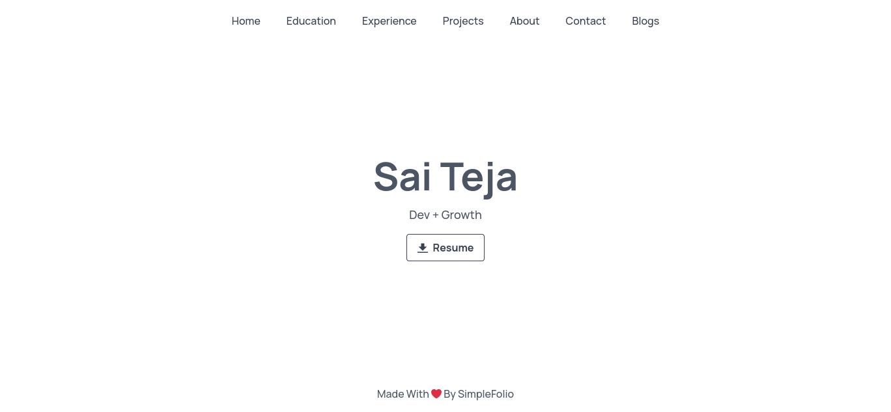

<h1 align="center"> SimpleFolio 🚀 </h1> 
<h3 align="center"> A Fully Customisable Portfolio Template For Minimalistic Lovers  </h3>

  
  
  
  
   
  
  
  
  

 
    </img>

**Note: The Project is currently under development.**

A minimalistic, fully customisable portfolio template which anyone from any domain can use. Just add your details in `src/data/portfolio.js` and your portfolio website is ready.

## Contributing 💡

If you can help us with these. Please don't hesitate to open an [pull request](https://github.com/saiteja13427/simple-folio/pulls) or [issue](https://github.com/saiteja13427/simple-folio/issues).
